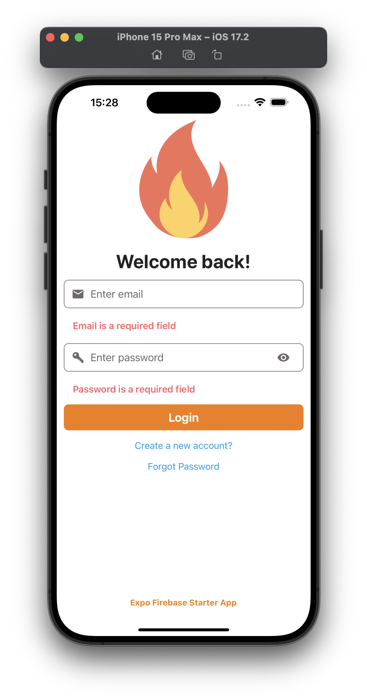
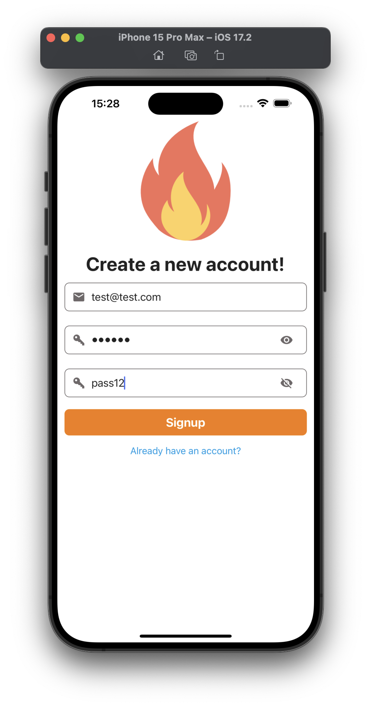
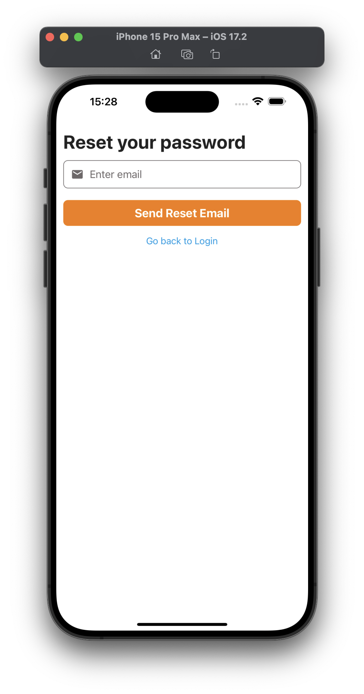
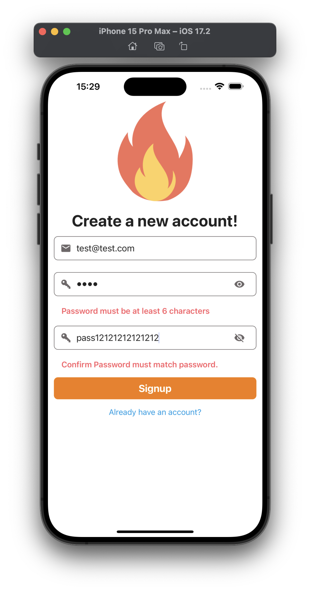

# Timeless Flow  🚀
### Mobile App

### **"Bridging the gap with timeless talent”**


  
-
[](https://expo.dev/client)

**Timeless Flow** is a mobile application developed with **Expo** and **Firebase**, offering essential features for modern and intuitive management. This app includes login, signup, password reset, and secure home screens.

## Main Features

- **Login and Signup with Firebase**
- Password reset via email
- User state management with Context API
- Form validation with Formik and Yup
- Protected navigation with `react-navigation`
- Reusable and custom components
- Environment variable management with `dotenv`

## Installation

1. Clone this repository:
   ```bash
   git clone https://github.com/Holbiwan/Timeless-Flow.git
   cd Timeless-Flow
   ```

2. Install dependencies:
   ```bash
   yarn install
   ```

3. Configure your Firebase variables:
   - Rename the file `example.env` to `.env`.
   - Update the Firebase keys in `.env`:
     ```env
     API_KEY=XXXX
     AUTH_DOMAIN=XXXX
     PROJECT_ID=XXXX
     STORAGE_BUCKET=XXXX
     MESSAGING_SENDER_ID=XXXX
     APP_ID=XXXX
     ```

## Running the Project

To start the development server:
```bash
npx expo start
```

To create a local build or use a development build:
```bash
# Build for Android
npx expo run:android

# Build for iOS
npx expo run:ios
```

## Project Structure

```plaintext
Timeless Flow
├── assets            # Static assets (images, fonts, etc.)
├── components        # Reusable UI components
│   └── Button.js
│   └── TextInput.js
│   └── LoadingIndicator.js
├── config            # Configuration files
│   └── firebase.js   # Firebase configuration
│   └── theme.js      # App theme (colors, styles)
├── navigation        # Navigation management
│   └── AppStack.js   # Protected routes
│   └── AuthStack.js  # Authentication routes
├── screens           # Main app screens
│   └── LoginScreen.js
│   └── SignupScreen.js
│   └── HomeScreen.js
├── App.js            # Application entry point
└── app.config.js     # Expo configuration
```

## Screenshots

### Login Screen


### Successful Signup


### Password Reset


### Field Validation


## Technologies Used

- **Expo SDK**: For mobile app development
- **Firebase**: Backend for authentication and data
- **React Navigation**: Screen and route management
- **Formik & Yup**: Form validation
- **React Native Vector Icons**: Custom icons
- ** **: 


## License

This application is licensed under the MIT License. See the [LICENSE](./LICENSE) file for details.

---

Developed with ❤️ by **Sabrina PAPEAU**.

### Social Media

X (ex twitter)   : <https://x.com/Holbiwan_Place> 

Facebook         : <https://www.facebook.com/Holbiwan.Saby> 

Instagram        : <https://www.instagram.com/holbiwan.saby/> 
